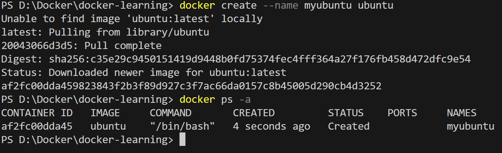
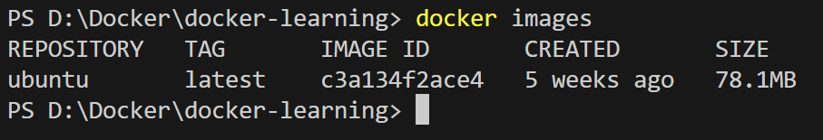
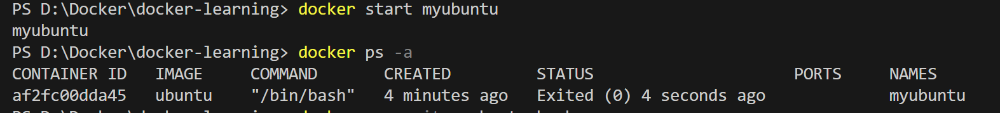
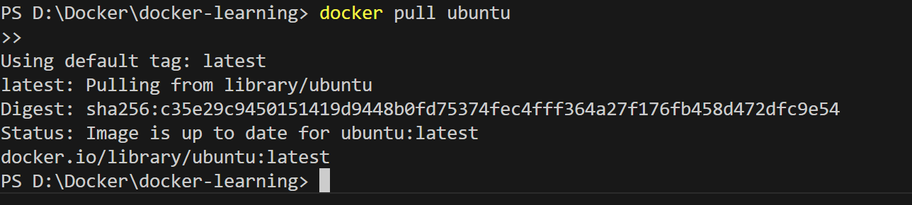
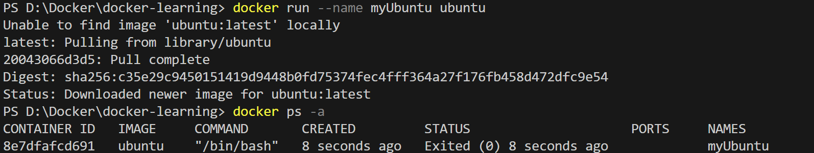
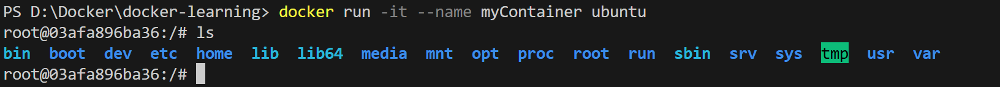
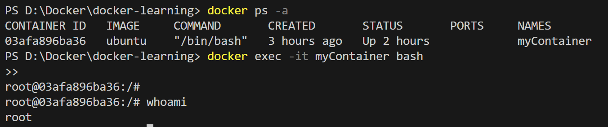
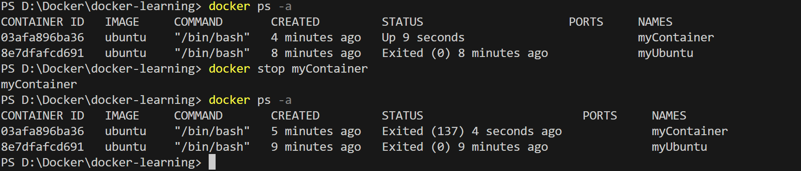
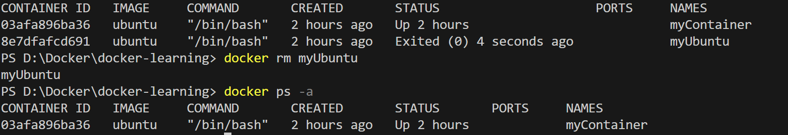
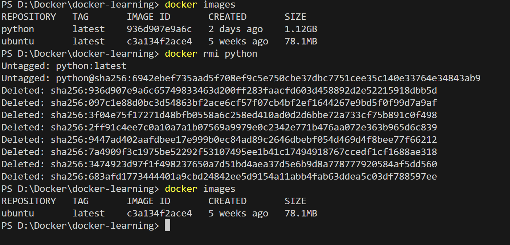

# 🐳 Docker Basics – Images, Containers & Commands

A clean and beginner‑friendly guide covering Docker images, containers, commands, volumes, ports, and examples with screenshots.

---

# 📌 1. What is a Docker Image?

* A **read‑only template** used to create containers.
* Contains application code, OS libraries, tools, and dependencies.
* Example: `python`, `ubuntu`, `nginx`, `mysql`.

---

# 📌 2. What is a Docker Container?

* A **running instance** of an image.
* Lightweight, isolated, fast.
* Exists only to run a **single main process**.

  * When the process stops → container exits.

---

# 📁 3. Image & Container Commands

## **docker create <image>**

Creates a container but **does NOT start it**.

```
docker create ubuntu
```



---

## **docker images**

Lists all images on your machine.

```
docker images
```



---

## **docker start <container>**

Starts an existing container.

```
docker start myubuntu
```



📝 **Why container shows "exited":**
Containers run a single command → if that command ends, container stops.

---

## **docker pull <image>**

Downloads image from Docker Hub.

```
docker pull nginx
```



---

## **docker run <image>**

Creates **and** starts container.

```
docker run ubuntu
```



---

## **docker run -it <image> bash**

Runs and opens an **interactive shell**.

```
docker run -it ubuntu bash
```



---

## **docker exec -it <container> <cmd>**

Runs new commands inside a running container.

```
docker exec -it myContainer bash
```



---

## **docker stop <container>**

Stops a running container.

```
docker stop myContainer
```



---

## **docker rm <container>**

Removes a container.

```
docker rm myContainer
```



---

## **docker rmi <image>**

Removes an image.

```
docker rmi ubuntu
```



---

# 🔍 4. Inspecting Containers

## **docker logs <container>**

Shows logs.

## **docker inspect <container>**

Shows detailed JSON information.

---

# 🔄 5. Container Lifecycle

```
Created → Running → Stopped → Removed
```

---

# ⚙️ 6. Common Flags Explained

Example:

```
docker run -d --name mydb -e MYSQL_ROOT_PASSWORD=admin123 -v mysql_data:/var/lib/mysql -p 3306:3306 mysql
```

### **-d (detached mode)**

Runs container in background.

### **-e (environment variables)**

 environment variables inside the container. [MySQL needs configuration at startup. Docker uses environment variables to pass this configuration.]

### **-v (volume)**

```
-v mysql_data:/var/lib/mysql
```

-v Create (or use) a volume named mysql_data on my machine and attach it to the container’s directory /var/lib/mysql, where MySQL stores its database files.

### **-p (port mapping)**

```
-p 3306:3306
```
-p is used to map ports between the host machine and the Docker container.


---

# 🧠 7. Summary

* Images = Templates
* Containers = Running instances
* `run` = create + start
* `create` = only create
* `start` = start existing container
* `exec` = run commands inside running container
* `-v` = persistent storage
* `-p` = host ↔ container mapping
* `-e` = environment variables
* Volumes survive container deletion
