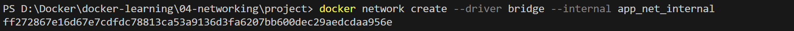
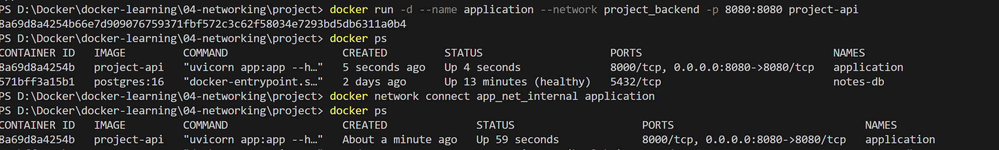
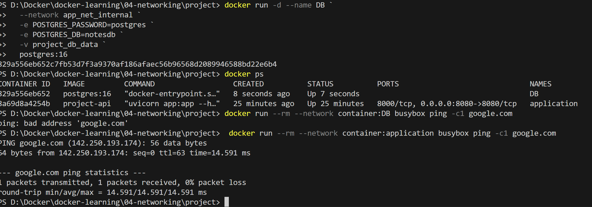

# Notes API

A simple FastAPI Notes application where users can create and view notes.
The application is fully containerized using Docker.

Previously, the notes were stored in an file.
Now, the project is refactored to use a database running in a separate container.
The FastAPI application communicates with the database through Docker networking, enabling clean separation between services and better scalability.
We will use only user defined bridge network in this project

To enhance security, the database container is isolated from the internet by placing it only on a private internal Docker network.

The FastAPI application is attached to both networks—
    Private network → for secure DB communication
    Public network → for external/internet access

## Features

- Add a note (`POST /add/notes`)  
- List all notes (`GET /notes/all`)  
- Runs in a Docker container for consistency  
- Lightweight and easy to extend

---

## Tech Stack

- **Python 3.13**  
- **FastAPI** (API framework)  
- **Uvicorn** (ASGI server)  
- **Docker** (containerization)
- **sqlalchemy**
- **psycopg2-binary**

---

## Clone the repository

```
git clone <repo-url>
cd project
```

---

## Running with Docker
* Build Docker image

```
docker build -t notes-api .
```

* Create a Docker volume for persistent storage
```
docker volume create db_volume
```

* Create a network for communication between the containers
```
docker network create --driver bridge --internal private_net
docker network create --driver bridge public_net
```


* Run the container with attached network

```
docker run -d --name application --network public_net -p 8080:8080 notes-api
docker network connect private_net application
```


```
docker run -d --name DB `
  --network private_net `
  -e POSTGRES_PASSWORD=postgres `
  -e POSTGRES_DB=notesdb `
  -v db_volume `
  postgres:15
```
* check results if db is able to access

```
docker run --rm --network container:notes-db busybox ping -c1 google.com
```


---

## API Endpoints

| Method | Endpoint      | Description                                                                |
| ------ | ------------- | ---------------------------------------------------------------------------|
| POST   | `/add/notes`  | Add a new note. Body: `{ "title": "Docker learning", "category": "Devops", "content" :  Understanding images, containers, and volumes"] }`                                                                  |
| GET    | `/notes/all`  | Get all notes                                                              |
                                                

---


## Access the API

* FastAPI docs (Swagger UI): http://localhost:8000/docs